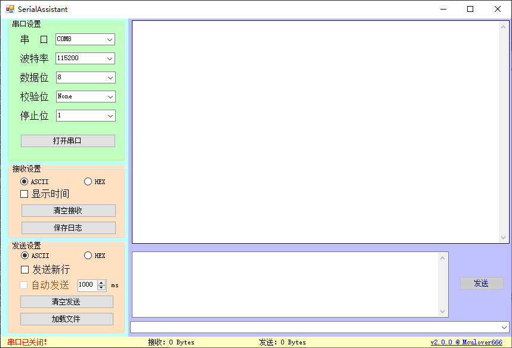

# SerialAssistant串口助手

下载地址：

- 本仓库release文件夹
- [在线下载：http://mculover666.cn/SerialAssistant.zip](http://mculover666.cn/SerialAssistant.zip)

# 功能说明

本项目是使用C# + WinForm框架编写的串口助手。

目前版本为2.0.0版本，拥有以下功能：

- 未打开串口时，自动扫描可用端口
- 接收数据支持文本或者HEX方式显示
- 支持接收数据加入时间戳
- 支持将当前接收数据保存为文件
- 支持发送文本数据或HEX数据
- 支持自动定时发送数据
- 支持从文件中(.txt, .json)加载数据到发送文本框
- 支持发送数据记录(不重复记录)
- ……欢迎加入更多功能

# 环境说明

- VS2019
- .NET Framework 4.5

# 教程

- [C#上位机开发（一）—— 了解上位机](https://blog.csdn.net/Mculover666/article/details/80650061) 
- [C#上位机开发（二）—— Hello，World](https://mculover666.blog.csdn.net/article/details/80650063)
- [C#上位机开发（三）—— 构建SerialAssistant雏形](https://mculover666.blog.csdn.net/article/details/80650067)
- [C#上位机开发（四）—— SerialAssistant功能完善](https://mculover666.blog.csdn.net/article/details/80650078)
- [C#上位机开发（五）——SerialAssistant界面升级（WinForm界面布局进阶）](https://mculover666.blog.csdn.net/article/details/116483736)
- [C#上位机开发（六）——SerialAssistant功能优化（串口自动扫描功能、接收数据保存功能、加载发送文件、发送历史记录、打开浏览器功能、定时发送功能）](https://mculover666.blog.csdn.net/article/details/116518368)
- [C#上位机开发（七）—— 修改窗口图标和exe文件图标](https://mculover666.blog.csdn.net/article/details/116540638)
- [C#上位机开发（八）—— 美化界面（给按钮添加背景）](https://mculover666.blog.csdn.net/article/details/116563863)

# 更新日志

2018/6/3

1. 完成串口属性设置，打开与关闭异常处理;
2. 字符串发送功能;
3. 字符串接收功能;

2018/6/4

1. 完善串口扩展功能界面部分

2018/6/6
  
1. 完善串口扩展功能后台搭建

2021/5/8

1. 改进UI界面，升级v2.0.0版本
2. 优化功能逻辑，升级v2.0.0版本

2021/5/9

1. 改进按钮样式，升级v2.1.0版本